> ** 📌 For questions, please refer to <strong>[zzsza 's Datascience-Interview-Questions](https://github.com/zzsza/Datascience-Interview-Questions) </strong> Note : **

## Table of Contents

- [ I know In the existing metric about Please explain . (ex. RMSE, MAE, recall, precision ...)](#1)
- [ Normalization why Should I do it ? Normalization The method is What is Is there one ?](#2)
- [Local Minima and Global Minimum about Please explain .](#3)
- [ Dimension In the curse about Please explain .](#4)
- [ With dimension reduction technique commonly which Things Is there one ?](#5)
- [PCA is dimension reduction As a technique , data compression It's also a technique And , noise It is also a removal technique I do . Why That's so Please explain number Is there one ?](#6)
- [LSA, LDA, SVD , etc. The weak which It means each other which Relationship Have you got it? To explain number Is there one ?](#7)
- [Markov Chain To high school students To explain which The method most Is it okay ?](#8)
- [ Text In the pile The subject Need to extract I do . What kind of In a way Approach Would you like to go out ?](#9)
- [SVM is why on the other way Dimension Expanding In a way Will it work ? SVM why Is it okay ?](#10)
- [ different good Machine Running Contrast , old Technique Naive Bayes (naive bayes ) Advantages Defend it .](#11)
- [ Regression / Classification The appropriate metric is What is it ?](#12)
- [Association Rule 's Support, Confidence, Lift ] about Please explain .](#13)
- [ Optimization Among the techniques, Newton's Method and Gradient Descent Method about I know Is there one ?](#14)
- [ Machine learning ( machine) Approach and Statistics (statistics ) The approach Between the two In the difference About Korea The view is Is there one ?](#15)
- [ Artificial neural network ( before deep learning ) Traditional ) Eggplant general The problem is What could it be ?](#16)
- [ now Come out In the deep learning series Innovation of The basis is What is it Do you think so ?](#17)
- [ROC curve about Please explain number Do you have it ?](#18)
- [ You guys 100 servers have There is . At this time Random Forest is better than artificial neural network Have to write The reason is What is it ?](#19)
- [K- means Representative Semantic The downside is What is it ? ( Calculation amount There are many Not to mention )](#20)
- [L1, L2 regularization about Please explain .](#21)
- [Cross Validation is What is it how Should I do it ?](#22)
- [ XGBoost Do you know why ? this The model On Kaggle Will it be famous ?](#23)
- [ Ensemble In the method which Things Is there one ?](#24)
- [ What is a feature vector? What could it be ?](#25)
- [ good Model's The definition is What could it be ?](#26)
- [ 50 small Decision making The tree big Decision making Than a tree Is it okay ? Why like that Do you think ?](#27)
- [ Spam In the filter Logistic Regression many Using The reason is What could it be ?](#28)
- [OLS(ordinary least squre) regression The formula is What is it ?](#29)

---

## #1

#### I know In the existing metric about Please explain . (ex. RMSE, MAE, recall, precision ...)

Evaluation indicator (metric ) ** categorized broadly For Evaluation criteria ** and ** regression For ** as evaluation criteria Divide number there is .

---

First of all, <strong> classification <strong> In the task </strong> To apply number present Evaluation criteria Let's take a look .

> ** Accuracy **

Accuracy is ** of the model The prediction is how much ** is it accurate ? It means that accuracy is <strong>( prediction The result Same data Number )/( Total prediction data <strong> number </strong> To calculate number There is . But Label Imbalance present In the data Accuracy If you use it not Yes . For example For example , 0 and 1 The ratio is 9: 1 The data is There is Did When , all to 0 If you predict Accuracy is 90% Come out It is . This is erroneous Because it is a judgment accurate Judgement For that different The indicator Must use Do it .

> ** Error Matrix (confusion matrix)**

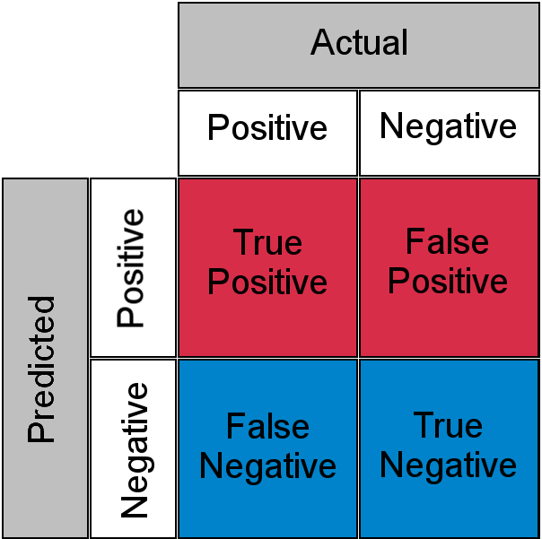

error The matrix is ** model Prediction and how much I'm confused Whether it exists Showing It is an indicator ** . Mainly Binary In the category many In use Binary In classification About Korea error The matrix is Above Like a picture together To show number There is . True Positive is In a positive way Prediction I did it actually Positive In this case , False Positive is In a positive way I predicted it actually Negative In case of , False Negative is In a negative way I predicted it actually Positive In this case , True Negative is In a negative way I predicted it actually Negative In the case Says . Above The value Based on The model which Error Whether it caused it To look into number there is .

For reference Accuracy is <strong>(TN + TP) / (TN + FP + FN + TP)</strong> . To calculate number there is .

> ** Precision , recall **

Precision and Reproducibility is ** positive data prediction In performance Focus on Fit ** is the evaluation index . Accuracy means ** the prediction In a positive way one data middle actually Positive Rate ** Speaking , the reproducibility is ** actually Positive data middle In a positive way As predicted Rate ** Says . Error The matrix As a standard Precision is <strong>TP / (FP + TP)</strong> , and recall is <strong>TP / (FN + TP)</strong> . To calculate number there is .

Precision and Reproducibility is ** a tradeoff Relationship ** Precision is FP , and recall is FN . By lowering affirmation Prediction of Performance Raise it . This same characteristic because The precision When it gets higher The reproducibility is Getting lower The reproducibility When it gets higher The accuracy is It gets lower . Most good In the case two characteristic all accordingly high This is the case .

> **F1-Score**

** Precision and Reproducibility one On the side Don't be biased Not two all Balance To do thing ** Shown That is `F1-Score` . F1- Score is Precision and Reproducibility By harmonic mean To calculate number there is .

$$
F1 = \frac{2}{\frac{1}{recall} + \frac{1}{precision}} = 2 * \frac{precision * recall}{precision + recall}
$$

> **ROC-AUC**

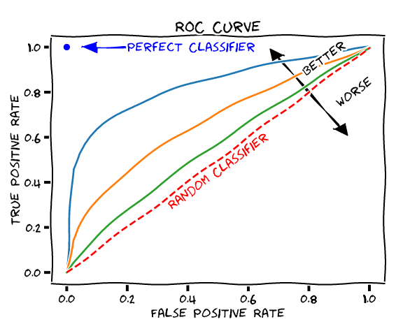

ROC is **FPR(False Positive Rate ) Change When TPR(True Positive Rate ) how Whether it changes representative Curve ** Here , FPR is <strong>FP / (FP + TN)</strong> and TPR is <strong> TP / (FN + TP)</strong> . Reproducibility Say . Then How to FPR Should I move ? Right now classification decision Threshold By changing Move number There is . FPR is 0 To be Set the threshold to 1 If you set it Okay . Then Positive The standard is It's high every In a negative way To be predicted is . On the contrary, 1 is To be Set the threshold to 0 By setting every In a positive way If you predict It can be done like this Threshold While moving The FPR and TPR that come out Each with x and y coordinates Leave it green The curve is the ROC .

AUC is the ROC curve The width Says AUC The higher the better That is , AUC left consolation The more it bends good Performance It's coming out Judge . That is , TPR is High and FPR The lower the better prediction The error is Get lower because Performance well Come out cheek number there is .

---

Finally ** Regression Work ** on To apply number present Evaluation criteria Let's take a look .

MAE(Mean Absolute Error) is ** the difference between the predicted value and Correct answer Between Difference of Absolute value of Average ** Says .

$$
MAE = \frac{1}{N} \sum^N_{i=1} |y_i - \acute{y_i}|
$$

MSE(Mean Squared Error) is ** the difference between the predicted value and Correct answer Between Difference of Square of Average ** Speaking , MAE and Differently Square Did because Outliers Sensitive .

$$
MSE = \frac{1}{N} \sum^N_{i=1} (y_i - \acute{y_i})^2
$$

RMSE(Root Mean Squared Error) is ** MSE Root Covered The value ** Says .

$$
RMSE = \sqrt{MSE} = \sqrt{\frac{1}{N} \sum^N_{i=1} (y_i - \acute{y_i})^2}
$$

RMSLE (Root Mean Squared Logarithmic Error) is the difference between RMSE and Similar but ** predicted value To the correct answer Each Log Put on Calculate ** Do .

$$
RMSLE = \sqrt{\frac{1}{N} \sum^N_{i=1} (\log(y_i+1) - \log(\acute{y_i}+1))^2}
$$

R Squared is ** variance Based on prediction Performance To evaluate Indicator ** Says the correct answer dispersion Contrast The predicted value dispersion The ratio As an indicator And , in 1 The closer Accuracy It's high .

#### References

- [14 Popular Machine Learning Evaluation Metrics - RUBIK'S CODE](https://rubikscode.net/2020/10/19/14-popular-machine-learning-evaluation-metrics/)
- [Metrics to Evaluate your Machine Learning Algorithm - towards data science](https://towardsdatascience.com/metrics-to-evaluate-your-machine-learning-algorithm-f10ba6e38234)
- [ machine learning terminology - google Machine learning short (https://developers.google.com/machine-learning/glossary )
- [3. Evaluation - Python Machine Learning Perfect Guide ](http://www.yes24.com/Product/Goods/87044746?OzSrank=1)
- [Regression model Evaluation : MSE, MAE, RMSE, RMSLE, R-Squared - Steadiness](https://steadiness-193.tistory.com/277)

---

## #2

#### Normalization why Should I do it ? Normalization The method is What is Do you have it ?

Normalization is ** individual Feature's Size every identical By unit Changing thing ** Says . Normalize doing The reason is ** feature The scale badly The difference I am case The value big The feature more Importantly be considered number Be there Because ** . This is stem for pitcher every Same On a scale To be reflected doing That is It's normalization .

Normalizing By way of As a representative example two Eggplant exists . first The second Normalization The method is <strong> min - max <strong>With normalization (min-max normalization)</strong> each Feature's Set the minimum value to 0 and the maximum value to 1 Leave it Converting is a method . Let the value be $x$ , the minimum value be $min$, and the maximum value be $max$ . two When , normalized The value is $\frac{x - min}{max - min} $ To calculate number There are two . The second Normalization <strong>Z- score by method <strong> Normalization (z-score normalization) </strong> There is . This The method is each Feature's Standard deviation and On average The value Normalize . Normalized The value is $\frac{x - mean}{std} $ To calculate number there is .

#### References

- [ Normalization made easy Understand - Anyway Work-life balance ](http://hleecaster.com/ml-normalization-concept/)
- [2. With scikit-learn Getting started Machine Learning - Python Machine Learning Perfect Guide ](http://www.yes24.com/Product/Goods/87044746?OzSrank=1)

---

## #3

#### Local Minima and Global Minimum about Please explain .

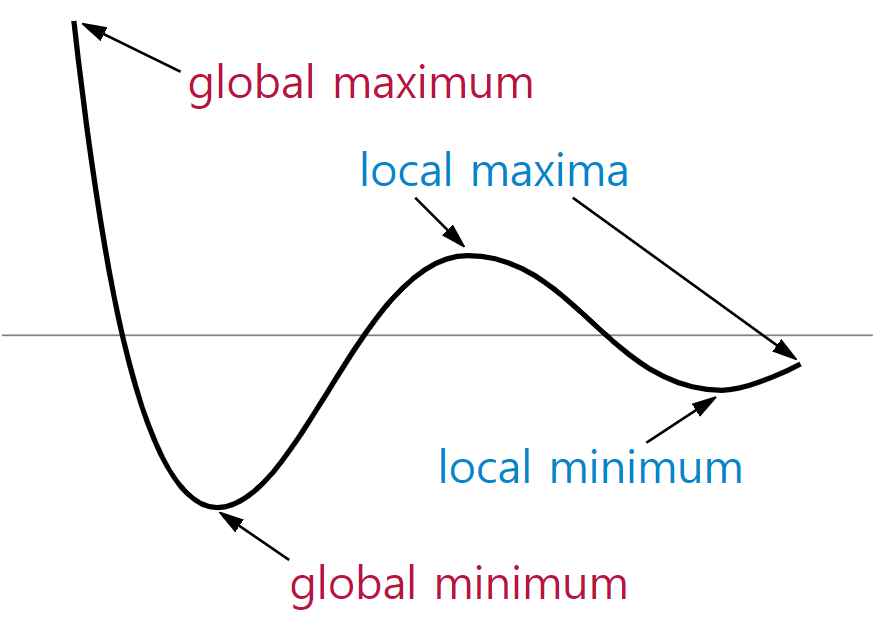

expense **Global Minimum** in the cost function is Error Minimized That is , we I want to find doing Branch Speaking , **Local Minima ** Error Minimum price Will be number present The candidate felled spot Among the Global Minimum minus Branch Says . Local Minima is If you're not careful ** errors are minimized Branch I found it ** be mistaken number Because there is In a trap To be likened to number There is . This Solve For Momentum and same Optimization The algorithm or use Learning rate well Adjust to Local Minima Get out number there is .

#### References

- [Local Minima Problem About Korea new Visual - Dark Programmer ](https://darkpgmr.tistory.com/148)
- [Minima - Hong's](https://jihongl.github.io/2017/09/18/minima/)

---

## #4

#### Dimension In the curse about Please explain .


Dimensional Curse is ** data Dimension As it increases corresponding Of space The size Exponentially Increased data liver The distance Exponentially Moving away Rare The structure Have felled Phenomenon ** Says this Solve For that Dimension As much as increased more many The data Add or PCA, LDA, LLE, MDS and same dimension reduction By algorithm Dimension Reduce To solve number there is .

#### References

- [ Dimension Curse of dimensionality - BioinformaticsAndMe](https://bioinformaticsandme.tistory.com/197)
- [ Dimension Problem - Dark Programmer ](https://darkpgmr.tistory.com/145)
- [6. Dimension Reduce - Python Machine Learning Perfect Guide ](http://www.yes24.com/Product/Goods/87044746?OzSrank=1)

---

## #5

Using dimension reduction techniques commonly which Things Do you have it ?

dimension Reduction is a <strong> feature <strong>Feature Selection</strong> and <strong> Features </strong> <strong> Feature extraction </strong> Divide number There is . First of all pitcher The choice is specific In the feature Dependency strong unnecessary The feature is Remove Of the data Features well Expressing Main Feature only Choosing That thing Says . On the other hand pitcher Extraction is existing The feature Low-dimensional As a feature Compress , feature implicitly well To explain number To be able to In low dimensions Mapping That thing Says . Representative pitcher extraction Algorithms include PCA, SVD, NMF, LDA , etc. there is .

#### References

- [6. Dimension Reduce - Python Machine Learning Perfect Guide ](http://www.yes24.com/Product/Goods/87044746?OzSrank=1)

---

## #6

#### PCA is dimension reduction As a technique , data compression It's also a technique And , noise It is also a removal technique I do . Why That's so Please explain number Do you have it ?

PCA(Principle Component Analysis ) ** Input Of the data Covariance The matrix Based on Eigenvector Create and like this Saved inherence In vector input The data Linear Convert to Dimension Shrinking method ** is . The dimension is soon input Of the data The feature Because it means data compression By technique cheek capital there is .

Also , PCA The eigenvalue is most big , that is Of the data Dispersion most big In order chief ingredient Vector To extract , the most later Picked Than vector most first Picked The vector The data more well To explain number Be there because Noise eliminate Also called technique It is called .

#### References

- [6. Dimension Reduce - Python Machine Learning Perfect Guide ](http://www.yes24.com/Product/Goods/87044746?OzSrank=1)
- [[ Technical Interview ] Dimension Reduction , PCA, SVD, LSA, LDA, MF Simple Summary (day1 / 201009) - Hui_dea](https://huidea.tistory.com/126)

---

## #7

#### LSA, LDA, SVD, etc. The weak which It means each other which Relationship Have you got it? To explain number Do you have it ?

`PCA` is **Principle Component Analysis ** In abbreviation Of the data Covariance The matrix Based on Eigenvector Create and like this Saved inherence In vector input The data Linear Convert to Dimension Shrinking is a method . `SVD` is **Singular Value Decomposition** . Abbreviated as PCA and analogous procession decomposition The technique Use it Square Matrix (square matrix ) Decomposing PCA and Differently Row and thermal The size different In the matrix too To apply number there is .

`LSA` stands for **Latent Semantic Analysis** In abbreviation Potential meaning Analysis Speaking , mainly Topic In modeling often Used It is a technique . LSA applies Truncated SVD to DTM (Document-Term Matrix) or TF-IDF (Term Frequency-Inverse Document Frequency) matrix . Apply to Dimension Reduce and the words Potential Meaning It derives . Truncated SVD is SVD and Same but Top n Only singular values Using reduction It is a method . This How to Write case one In a matrix To restore number does not exist .

`LDA` is **Latent Dirichlet Allocation** or **Linear Discriminant Analysis** . It is an abbreviation . The former is In topic modeling Used techniques middle With LSA as one Differently The word specific On the topic To exist Probability and In the document specific The topic is To exist The probability With joint probability Estimated Topic Estimating The technique says the latter Dimension reduction technique middle In one Classify Easy to do class liver Dispersion Maximize and class Inside Dispersion is Minimizing The way Says .

> **Latent Dirichlet Allocation** and relevant full The content is [#9 Text In the pile The subject Need to extract I do . What kind of In a way Approach Would you like to go out ?](#9 ) Please note !

#### References

- [ Potential meaning Analysis (Latent Semantic Analysis, LSA) - Deep Learning Used Natural language treatment Introduction ](https://wikidocs.net/24949)
- [ Potential Dirichlet Allocation (Latent Dirichlet Allocation, LDA) - Deep Learning Used Natural language treatment Introduction ](https://wikidocs.net/30708)
- [ document word Document -Term Matrix (DTM) - Deep Learning Used Natural language treatment Introduction ](https://wikidocs.net/24559)
- [TF-IDF(Term Frequency-Inverse Document Frequency) - Deep learning Used Natural language treatment Introduction ](https://wikidocs.net/31698)
- [6. Dimension Reduce - Python Machine Learning Perfect Guide ](http://www.yes24.com/Product/Goods/87044746?OzSrank=1)

---

## #8

#### Markov Chain To high school students To explain which The method most Is it okay ?

> ** Markov Chain (Markov Chain)**

Markov Chain is <strong> Markov temper Have Discrete Probability Discrete-time Stochastic Process </strong> Says .

> ** Markov Markov Property **

$n+1$ meeting The state is Only in $n$ rounds status , or that before schedule Of the period Only in status Influence subject That thing It means . For example If you listen coin Throwing is independence It's an implementation Because of the $n$ th The status is Front or back Follow or not The $n+1$ th liver In the state Influence gist No. But the first one Markov The chain is $n$ th The state is $n+1$ th Status In deciding Influence Crazy . ( At time $t$ Observation is only The last $r$ For observation only Depends on Home do that Under the assumption ) is established .

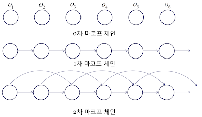

To sum up Markov The chain is a ** random variable which In state reach The probability is only as soon as before Point of view In state Run present In case ** Points to .

For example Listen , today's The weather Yesterday's Only in the weather If you depend on it, it 's primary Markov Chain , two days Until now Only in the weather If you depend on it, it's secondary Markov It's a chain .

> ** Markov Model (Markov Model)**

The Markov ** model Above Under the assumption Probabilistic The model made As a thing most first each Status Definition ** to do becomes . The state is $ V = v_1, ..., v_m$ . Define and m The status is To exist felled It is . That The following is the <strong> state transition <strong>State transition probability </strong> To define number There is . Status transition What is probability? each In the state each In condition Move The probability Says . Status transition The probability $a_{ij}$ is In state $v_i$ With state $v_j $ Move The probability It means . Below Cold situation transition The probability In this way Shown And that that Below is Probability of basic In the definition By situation transition Probability of It is a condition .

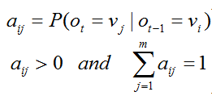

and Status and situation transition The probability <strong> Situation in order Also called <strong> state transition diagram</strong> To express number there is .

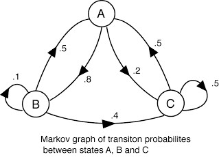

#### References

- [Markov Chain - MLWiki](https://sites.google.com/site/machlearnwiki/RBM/markov-chain)
- [[ Technical Interview ] Markov Chain, Gibbs Sampling, Markov Chain , Gibbs Sampling (day2 / 201010) - huidea](https://huidea.tistory.com/128?category=879541)
- [(Bayes Learning )(4) Markov Chain - (1) - Information Society Research Institute ](http://piramvill2.org/?p=905)

---

## #9

#### Text In the pile The subject Need to extract I do . What kind of In a way Approach Would you like to go out ?

> ** Potential Dirichlet Latent Dirichlet Allocation (LDA)**

Potential Dirichlet Allocation (LDA) is ** the document In the set Topic Finding out The process Meaning Topic Modeling of Representative Algorithm ** says LDA, " Documents are Topics of By mixing It is composed of , and the topics are Probability In the distribution Based on The words " Create " Assuming that the data is Given LDA , Topic The document Was being created The process Backtrack .

For example Come on , next same example 3 sentences There is Let's assume .

```text
Document 1: I am With apples Banana eat
Document 2: We cute The puppy great
Document 3: My Cute and cute The puppy Banana eat
```

LDA Through each ** Topics in the document Distribution ** and ** each Topic undergarment word Distribution ** Estimate number there is .

- ** each Of the document Topic distribution **
- Document 1: Topic A 100%
- Document 2: Topic B 100%
- Document 3: Topic B 60%, Topic A 40%
- ** each Topic of word distribution **
- Topic A: Apple 20%, Banana 40%, Eat 40%, Cute 0%, Puppy 0%, Cute 0%, Like 0%
- Topic B: Apple 0%, Banana 0%, Eat 0%, Cute 33%, Puppy 33%, Cute 16%, Like 16%

LDA is Topic of The title Don't decide But , this At this point The algorithm The user stomach From the results two The topic is Each In fruit About Korea Topic and To the puppy About Korea It's a topic Let's judge number there is .

#### References

- [Topic Modeling, LDA - ratsgo's blog](https://ratsgo.github.io/from%20frequency%20to%20semantics/2017/06/01/LDA/)
- [[ Technical Interview ] Potential Direcly Allocation (day3 / 201012) - huidea](https://huidea.tistory.com/130?category=879541)
- [ Deep Running Used Natural language treatment Introduction ](https://wikidocs.net/30708)

---

## #10

#### SVM is why on the other way Dimension Expanding In a way Will it work ? SVM why Is it okay ?

SVM (Support Vector Machine) is The data is Thoughtful ** Border in space ** is expressed , and in space ** There are several boundary middle most big Width Have The border Find .**

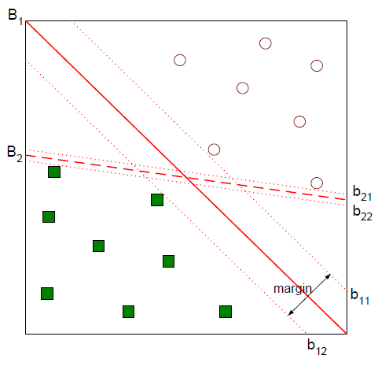

- $B_1$: Decision boundary
- $b_{11}$: plus-plane
- $b_{12}$: minus-plane

SVM 's The pros and cons are Next It's the same .

| Pros | Cons |
| ------------------------------------------------- | --------------------------------------------------------------------- |
| Classification and In regression every To use number There is . | Data Preprocessing and Parameters In settings according to Accuracy Will change number There is . |
| Neural network In technique Compare Overfitting The extent Low . | Forecast how Whether it will happen About Korea Understanding and In the model About Korea Interpretation It's difficult . |
| Prediction of Accuracy high . | large capacity In the data About Korea model Build city The speed Slow , memory The quota is It's big . |
| Low-dimensional and Higher dimension In the data About every well It works . | |

> ** Margin **

Margin is the space between plus-plane and minus-plane. The distance It means ** optimal decision The border is The margin Maximize ** .

SVM is Linear Just classification Not ** nonlinear Also in category ** It is used , nonlinear In the classification Input data Multidimensional Spatially To map When <strong> kernel <strong> Trick (kernel trick)</strong> Also use . The original space (Input Space ) The data Linear classification possible Higher dimension To Space (Feature Space) Mapped back two Category Classifying Superplane Find . (Kernel-SVM)


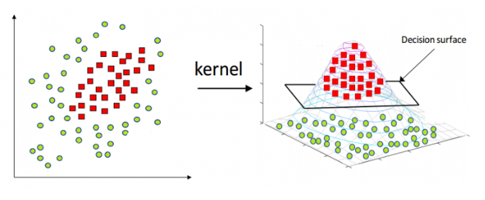

> ** Kernel Trick (Kernel Trick)**

Kernel The function Using ** dimensions space (low dimensional space ) Higher dimension Into space (high dimensional space) Mapping it Work ** It's a kernel trick Do it .

Kernel Function of The type is Next It's the same .

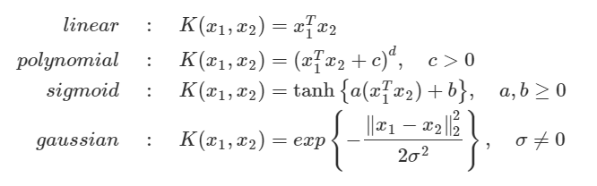

#### References

- [ Support vector Machine (Support Vector Machine) - ratsgo's blog](https://ratsgo.github.io/machine%20learning/2017/05/23/SVM/)
- [Kernel-SVM - ratsgo's blog](https://ratsgo.github.io/machine%20learning/2017/05/30/SVM3/)
- [Support Vector Machine (SVM) ] Concept - butter_shower](https://butter-shower.tistory.com/7)
- [Support Vector Machine (SVM, Support vector Machine ) - Excelsior-JH](https://excelsior-cjh.tistory.com/66)
- [ Support vector Machine (Support Vector Machine) Easy Understand - Anyway Warabel ](http://hleecaster.com/ml-svm-concept/)
- [ADP handwriting All Package data analyze Expert ](https://search.shopping.naver.com/search/all?where=all&frm=NVSCTAB&query=ADP+%ED%95%84%EA%B8%B0+%EC%98%AC%ED%8C%A8%ED%82%A4%EC%A7%80+%EB%8D%B0%EC%9D%B4%ED%84%B0+%EB%B6%84%EC%84%9D+%EC%A0%84%EB%AC%B8%EA%B0%80)

---

## #11

#### different good Machine Running Contrast , old Technique Naive Bayes (naive bayes ) Advantages Try to defend it .

In the data In variables ** Conditional for Korea Independence Assuming ** By algorithm In class About Korea dictionary Information and From data Extracted Information Combined , <strong> Bayes <strong> Bayes Theorem </strong> By using which The data is specific In class Belonging or not Classifying It's an algorithm .

Naive Bayes's The pros and cons are Next It's the same .

| Pros | Cons |
| -------------------------------------------------------------------------- | ---------------------------------------------------------------------- |
| Simple and Fast and very effective | all The property is Equally It's important Independent known defect At home depend on |
| Noise and Missing The data is Even if there is well perform | figure By property Composed of many In the dataset about Not ideal No |
| In training About Korea Relatively small An example But I need it very many Example too well perform | estimated The probability is As predicted Than category Less Trustworthy |
| In the prediction About Korea Estimated The probability Get Easy | |

#### References

- [ Easy forcible Machine learning , naive Bayes Classification (Naive Bayes Classification)- Jarvis I need it ](https://needjarvis.tistory.com/621)
- [ Naive Bayes The algorithm Advantages and Cons - Web Development Lab ](http://w3devlabs.net/wp/?p=17273)
- [ADP handwriting All Package data analyze Expert ](https://search.shopping.naver.com/search/all?where=all&frm=NVSCTAB&query=ADP+%ED%95%84%EA%B8%B0+%EC%98%AC%ED%8C%A8%ED%82%A4%EC%A7%80+%EB%8D%B0%EC%9D%B4%ED%84%B0+%EB%B6%84%EC%84%9D+%EC%A0%84%EB%AC%B8%EA%B0%80)

---

## #12

#### Regression / Classification The appropriate metric is What could it be ?

[#1](#1) Reply Please note that In the answer Don't describe Not Only indicators Additionally Explains .

> ** Regression **

$$
R^2 = \frac{\sum (\hat{y}_l - \bar{y})}{\sum (y_i - \bar{y})^2}
$$

The coefficient of determination is ( the coefficient of determination on the regression line ) By Explained change )/( total ) change Speaking of the independent variable The number of The more it increases The coefficient of determination is 1 It gets closer . The regression model high The coefficient of determination If you have it actually The model Explanatory power high Whether it is Simply Independent variable The number of many Whether it is Know It's difficult The coefficient of determination Trustworthy number No felled The problem is It happens .

$$
adj R^2 = 1 - \frac{n - 1}{(n - p - 1)(1 - R^2)}
$$

Modified The coefficient of determination is Coefficient of determination The problem Solve for Of the sample size (n) and Independent variable Number (p ) Taking into consideration Modified The coefficient of determination Calculate .

> ** Category **

$$ - (y - \log (p))) + (1 - y) \log (1-p) $$

Log Loss or Binary Crossentropy Binary In the classification As an indicator is used .

$$
LogarithmicLoss = - \frac{1}{N} \sum^N_{i=1} \sum^M_{j=1} y_{ij} * \log (p_{ij})
$$

Categorical Crossentropy is Need to classify There are 3 classes Strange person Multi class In the classification As an indicator is used .

#### References

- [상관계수 & 결정계수 & 수정된 결정계수 - 모찌의 맛집 통계](https://mansoostat.tistory.com/76)
- [[결정계수] R square와 adjusted R square - specialscene](https://specialscene.tistory.com/63)
- [3 Best metrics to evaluate Regression Model?](https://towardsdatascience.com/what-are-the-best-metrics-to-evaluate-your-regression-model-418ca481755b)
- [The 5 Classification Evaluation metrics every Data Scientist must know](https://towardsdatascience.com/the-5-classification-evaluation-metrics-you-must-know-aa97784ff226)

---

## #13

#### Association Rule Support , Confidence, Lift about Please explain .

Association Analysis is profusely Shopping Cart Analysis (Market Basket Analysis) or It's called sequence analysis . It is called . The company's In the database Of the product Purchase , Service ** A series of transaction or Events Between The rules Discover for ** Apply and Relevance Analysis of evaluation The indicators are Support, Confidence, and Lift . Use .

> ** Support **

entire transaction middle Item A and Item B at the same time Including of the transaction By ratio Define .

$$
Support = P(A \cap B) = \frac{ A and B at the same time Included Number of transactions }{ Total {Transactions } = \frac{A \cap B}{ Total }
$$

> ** Confidence **

Item A inclusive transaction between Item A and Item B together To be included It's probability . It's correlation. The degree Understand number there is .

$$
Confidence = \frac{P(A \cap B)}{P(A)} = \frac{ A and B at the same time Included Transaction number }{ A Including {number of transactions } = \frac{ support }{P(A)}
$$

> **Lift( Improvement )**

A Not purchased Didn't at the time Item B Purchase probability Compared to A It was purchased at the time Item B Purchase probability increase It is raining . The association rule A→B is Item A and Item B Purchase price each other Related to no In case The improvement is 1 It can be done .

$$
Improvement = \frac{P(B | A)}{P(B)} = \frac{P(A \cap B)}{P(A)P(B)} = \frac{A and B are at the same time Included Transaction number }{ A Including The number of transactions \times B Including {number of transactions } = \frac{ confidence }{P(B)}
$$

---

Er Come in which 5 people in the supermarket To the customer By 5 ($N = 5$) cases occurred Make a deal With the association rule X:{ eggs , beer } → Y: { diapers } about Let's take a look .

| Customer<br>ID | Transaction<br>ID | Items |
| :------------: | :------------------: | :------------------------------------: |
| 1131 | no.1 | Eggs , Milk |
| 2094 | no.2 | <U> Eggs , Diapers , Beer </U>, Apples |
| 4122 | no.3 | Milk , diapers , beer , cola |
| 4811 | no.4 | <U> Eggs </U>, milk , <U> Beer , diapers </U> |
| 8091 | no.5 | Eggs , milk , beer , cola |

$$ P(Y) = \frac{n(Y)}{N} = \frac{n \\{ no.2, no.3, no.4 \\} }{N} = \frac{3}{5} = 0.6 $$

- Support = $s(X→Y) = \frac{n(X\cup Y)}{N} = \frac{n \\{ no.2, no.4 \\} }{N} = \frac{2}{5} = 0.4$
- Confidence = $c(X→Y) = \frac{n(X\cup Y)}{n(X)} = \frac{n \\{ no.2, no.4 \\} }{n \\{ no.2, no.4, no.5 \\} } = \frac{2}{3} = 0.6667$
- Improvement (Lift) = $Lift(X→Y) = \frac{c(X→Y)}{s(Y)} = \frac{0.6667}{0.6} = 1.1111$

#### References

- [[R Association Rule ] Support , confidence , lift , IS measure , cross-support - R, Python analysis and of programming Friend (by R Friend)](https://rfriend.tistory.com/191)
- [ADP handwriting All Package data analyze Expert ](https://search.shopping.naver.com/search/all?where=all&frm=NVSCTAB&query=ADP+%ED%95%84%EA%B8%B0+%EC%98%AC%ED%8C%A8%ED%82%A4%EC%A7%80+%EB%8D%B0%EC%9D%B4%ED%84%B0+%EB%B6%84%EC%84%9D+%EC%A0%84%EB%AC%B8%EA%B0%80)

---

## #14

#### Optimization Among the techniques, Newton's Method and Gradient Descent Method about I know Do you have it ?

> **Newton's Method**

The second order of the function $f$ Taylor Approximation (quadratic approximation) is Next It's the same .

$$
f(y)\approx f(x)+\nabla f(x)^T(yx)+\frac{1}{2}(yx)^T\nabla^2f(x)(yx),
\\
f_{approx}(y)=f(x)+\nabla f(x)^T(yx)+\frac{1}{2}(yx)^T\nabla^2f(x)(yx)
$$

Here, $y$ is next The $x$ value of the step is $x^+$ . Also, the quadratic approximation is $f_{approx}$ . Decide .

This $f_{approx}$ i.e. quadratic approximation At least fabricated Input $y $ To find . At this time, $ f_{approx}$ is convex , so stomach The gradient of the equation is 0 fabricated Input $y$ is $f_{approx} $ At least Make It is . This The result is the step update equation in Newton's method. It is possible . Below Food Differentiation is in $y$ About Korea differential It is Let's remember .

$$
\nabla f_{approx}(y)=\nabla f(x)+\frac{1}{2}\left((\nabla^2f(x))^T(y-x)+(y-x)^T\nabla^2f(x)\right)
\\
=\nabla f(x)+\nabla^2f(x)(y-x)\qquad\qquad\qquad
\\
= 0,\qquad\qquad\qquad\qquad\qquad\qquad\qquad\quad\;\,
\\
\Leftrightarrow y=x-(\nabla^2f(x))^{-1}\nabla f(x)\qquad\qquad\;
$$

> **Gradient Descent**

In gradient descent The second order of the function $f$ Taylor The details Use , 2nd protest case Actual 2nd differential The result No , square matrix (identity matrix) and Let's call this $t$ Divided By value Assume .

$$
f(y)\approx f(x)+\nabla f(x)^T(yx)+\frac{1}{2t}\parallel yx\parallel^2_2,
\\
f_{approx}(y)=f(x)+\nabla f(x)^T(yx)+\frac{1}{2t}\parallel yx\parallel^2_2
$$

Newton's method and Same as stomach The value of $y$ for which the gradient of the approximation is 0 , i.e. $x^+ $ To decide number there is .

$$
\nabla f(y)=\nabla f(x)+\frac{1}{t}(yx),
\\
=0,\qquad\qquad\;
\\
\Leftrightarrow y=xt\nabla f(x)
$$

In the steps of **Newton's method** and **Gradient descent** Followed convergence direction comparison


- Blue : Newton's method
- Black : Gradient descent

Gradient descent is quadratic Differential term In a square matrix Constant Multiplied By value Assuming gradient Calculate Because of the contour lines tangent In the direction Converging vertically (perpendicular) To check number There is , and in Newton's method Compare slow convergence Speed up It is visible .

#### References

- [14-01-01 Newton's method interpretation - All For Convex Optimization ](https://convex-optimization-for-all.github.io/contents/chapter14/2021/03/26/14_01_01_newton_method_interpretation/)
- [ Newton's law / Newton - Raphson law Understanding and Utilization (Newton's method) - Dark Programmer ](https://darkpgmr.tistory.com/58)
- [Gradient Descent Exploration Method - Dark Programmer ](https://darkpgmr.tistory.com/133)
- [ Week 4 \_#2. Optimization Among the techniques, Newton's Method and Gradient Descent Method are used. Explain . - I To see made Space ](https://astralworld58.tistory.com/86)

---

## #15

#### Machine learning ( machine) Approach and Statistics (statistics ) The approach Between the two In the difference About Korea The view is Do you have it ?

Machine learning Approach and Statistical The approach The difference is two Method of main The purpose is It's different It is .

Machine learning The approach is ** Prediction of the model Success rate ** Height is The purpose is .
thus Model's Reliability or elaborate than home various Feature Using ( overfitting) Even taking into account ) high Prediction rate To achieve Do it .

Statistical The approach is Distribution and Home ** Trust through It is possible A sophisticated ** model Making it The purpose is .

thus The model Not complicated Not Simply Make and what The feature which The cause Give it to me egg number To be able to Do it .

#### References

- [ Machine learning and Traditional Statistics Difference - Hyunseok Choi](https://medium.com/@hyunseok/%EB%A8%B8%EC%8B%A0%EB%9F%AC%EB%8B%9D%EA%B3%BC-%EC%A0%8 4%ED%86%B5%EC%A0%81-%ED%86%B5%EA%B3%84%ED%95%99%EC%9D%98-%EC%B0%A8%EC%9D%B4-a560f0708db0)
- [Machine Learning and Traditional Statistical analysis Method of Difference ](https://ek-koh.github.io/data%20analysis/ML-diff/)

---

## #16

#### Artificial neural network ( before deep learning) Traditional ) Eggplant general The problem is What could it be ?

Deep Learning Previous Artificial neural networks Linearly only Regression , classification To perform because Layer deep Stack Couldn't do it , because of XOR problem same complicated The problem Solve Can't do it The problem is There was .

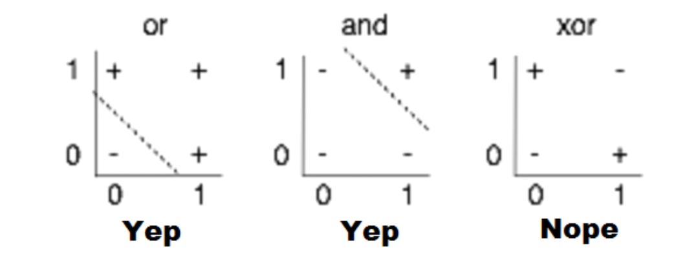

but Sigmoid and same Nonlinear The function Linear In the model Adding XOR problem Solve and differentiate Chain rule Used Backpropagation of error By way of The model To update number Have As it becomes Layer deep Stacked Deep Learning Artificial neural network Developed .

#### References

- [1.2 Deep Learning Previous : Machine Running's curt History - Tensor Flow Blog ](https://tensorflow.blog/%EC%BC%80%EB%9D%BC%EC%8A%A4-%EB%94%A5%EB%9F%AC%EB%8B%9D/1-2-%EB%94%A5%EB%9F%AC%EB%8B%9D-%EC%9D%B4%EC%A0%84-%EB%A8%B8%EC%8B%A0-%EB%9F%AC%EB%8B%9D%EC%9D%98-%EA%B0%84%EB%9E%B5%ED%95%9C-%EC%97%AD%EC%82%AC/)
- [ Everyone For Deep Learning - Sung Kim](https://www.youtube.com/watch?v=n7DNueHGkqE&list=PLlMkM4tgfjnLSOjrEJN31gZATbcj_MpUm&index=22)

---

## #17

#### now Come out In the deep learning series Innovation of The basis is What is it What do you think ?

ImageNet and Same ** huge high Quality of Dataset ** This To everyone As it was revealed Deep learning innovatory Development to start number There was . Now more various In the task good Good GLUE like Data too It's been made public more Deep learning In development Contribute there is .

today good Performance smoking Deep Learning The models are every big Of scale These are models of ** hardware Development ** This Possibly Did .

Also **end-to- end model ** As it appears data Labeling , Hyperparameters Find , Optimal model Find etc. every Work To the machine While leaving it to you Deep learning big Developed .

#### References

- [end-to-end learning Pros and Cons - Thinking a lot Timid Man ](https://talkingaboutme.tistory.com/entry/MLY-end-to-end-%ED%95%99%EC%8A%B5%EC%9D%98-%EC%9E%A5%EB%8B%A8%EC%A0%90)

---

## #18

#### On the ROC curve about Please explain number Do you have it ?

ROC curve is ** binary classification Model's Performance ** representative It is an indicator .

The model It's true Predicting The case is **FPR** (False Positive Rate, real The value It's a lie time ) and **TPR** (True Positive Rate, actual The value True When ) two In case It is divided .
FPR and TPR On the graph, the x- axis and y- axis at the same time The ROC curve expressed Through The model how much correct The value well Predicting egg number Have It can be done .

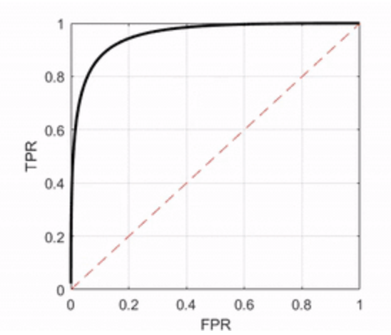

The ROC curve Top left and near case good As a model To judge number There is a model called FPR . Low , TPR is High Predict Because .

#### References

- [ROC curve - Gongdol's math organize Note ](https://angeloyeo.github.io/2020/08/05/ROC.html)

---

## #19

#### You guys 100 servers have There is . At this time Random Forest is better than artificial neural network Have to write The reason is What is it ?

** Random Forest ** is several decision The tree In an ensemble One As a model Composing It's a method . Random In the forest each The server Model's Characteristics Understand single decision ** Parallel ** with a tree (Decision tree) to configure number there is .

On the other hand , ** artificial neural networks ** One Server Itself Model's Characteristics every ** Serial ** in an end-to-end structure that makes sense It consists of .

thus 100 servers There will be When , this In parallel To utilize number ** Random Forest ** Use .

#### References

- [Random Forest ( Random Forest ) concept Summary - Codesigner's Dev Story](https://eunsukimme.github.io/ml/2019/11/26/Random-Forest/)
- [ Decision tree - ratsgo's blog](https://ratsgo.github.io/machine%20learning/2017/03/26/tree/)
- [ go to work Routine , 3 questions a day - Man-About-Town](https://yongwookha.github.io/MachineLearning/2021-01-29-interview-question)

---

## #20

#### K- means Representative Semantic The downside is What is it ? ( Calculation amount There are many (not to mention )

K-means is The characteristic similar The data same In a group Tying it up Clustering Algorithmically , there are k association The number of Decide Cluster of The center point By prediction each With data The distance Compared to after Cluster Decide .

**K-means algorithm The disadvantages are ** Next It's the same .

- K some Dog Whether to set it or not according to Performance It changes .
- K dog Cluster of The center point Must predict But where As a central point In two days according to Performance It changes .
- The data well Gathered In case Not effective , noisy many case Not effective No .

#### References

- [ Machine Learning - 7. K- Mean Clustering (K-means Clustering) - Corners Study ](https://bkshin.tistory.com/entry/%EB%A8%B8%EC%8B%A0%EB%9F%AC%EB%8B%9D-7-K-%ED%8F%89%EA%B7%A0-%EA%B5%B0%EC%A7%91%ED%99%94-K-means-Clustering)

---

## #21

#### L1, L2 regularization about Please explain .

Normalization (** Generalization ** ) The purpose is The model Learning In the data No overfitting Not first Seeing test Also in data good Performance Towards me fabricated It is .

Model's Learning is done using a loss function. Minimizing In the direction It's in progress .

this When , L1, L2 regularization in loss function The term (norm ) By adding The model is The existing loss While reducing Normalization ( of the model ) Feature values and Related ) Reduce In the direction It is learned .

Model's The feature value is In the decrease according to specific The feature too big The value Have it Not to As it becomes Overfitting To prevent number Have It can be done .

> **L1 regularization ( Lasso Regression )**

L1 regularization is specific Feature's The value very low In case ( outlier ) 0 Converging Features There is . Specific The feature is 0 Become Disappearing It is **feature selection** and Same as cheek number there is .

$$
Cost = \sum^N_{i=0} (y_i - \sum^M_{j=0} x_{ij}W_j)^2 + \lambda \sum^M_{j=0} |W_j|
$$

> **L2 regularization ( ridge Regression )**

L2 regularization is specific Weight's The value very Even if it's low, it's 0 Not converging Not Getting closer Features There is . This is L1 regularization. Compare Not strong Not to Normalization Run it always Linear In the model generalization The effect line number there is .

$$
Cost = \sum^N_{i=0} (y_i - \sum^M_{j=0} x_{ij}W_j)^2 + \lambda \sum^M_{j=0} W_j^2
$$

In the loss equation Lambda Model's In the weight For L1 or L2 norm By adding Model's Generalizer It becomes possible .

loss is data Value and calculation Value of By difference The model has loss Minimizing In the direction When learning , use L1 or L2 regularization. If you use it, there is a loss Weight's As much as the size Get bigger because data In value prediction The value does not fit Don't do it Because .

> **Norm**

Norm is Vector's Size representative As such, L1 Norm is Vector's Absolute value Size , and L2 Norm is beeline Distance ( square of root ) It shows .

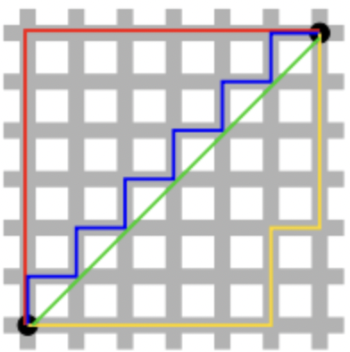

stomach In the picture The green line is the L2 norm . Meaning , and the rest The line is L1 norm It means .

- **L1 loss**

$$
L1LossFunction = \sum^n_{i=1} |y_{true} - y_{predicted}|
$$

- L2 loss

$$
L2LossFunction = \sum^n_{i=1} (y_{true} - y_{predicted})^2
$$

#### References

- [ Deep Learning Terminology Theorem , L1 Regularization, L2 Regularization Understanding , purpose and difference Description - Shining Tree ](https://light-tree.tistory.com/125)
- [L1, L2 Norm, Loss, Regularization? - thought Summary ](https://junklee.tistory.com/29)
- [ Ridge regression , Lasso regression , Elasticnet - Graduate student easy Explain ](https://hwiyong.tistory.com/93)

---

## #22

#### Cross Validation is What is it how Should I do it ?

**Cross validation( cross validation ) ** is **train( learning ) data Learned The model is used for learning Not used Unvalidated data As a standard how much well Does it work? To confirm It is . Here Be careful The point is that the train dataset and validation dataset have a test dataset. If included No way It is .

Cross validation Through Get number There are ** pros and cons ** Below It's the same .

- Less In the data Validation reliability for Korea Raise number there is .
- every The dataset In training To utilize number Because there is data Bias Stop it number There is . (k-fold case )
- verification In the result according to more Generalized The model Make number there is .
- Model In learning Long time Time It takes .

Cross validation ** Type ** of technique is Below Same as . (validation dataset how Whether to specify or not according to It changes .)

- Hold out Holdout Cross Validation
- K- fold Cross Validation (K-fold Cross Validation)
- k -fold by layer Cross Validation (Stratified K-Fold Cross Validation)

> ** Hold out Cross validation **

Holdout The cross-validation method is certain Validation dataset of ratios One By specifying verification With a dataset Using It is . Holdout Cross validation Using In case , there are two The problem is It exists .

1. With validation dataset Specified Part of The data is With the learning set Not used I don't say no problem
2. In the validation dataset To be biased The model To adjust It is possible problem

This Solve For k- fold Cross validation Appeared .

> **k- fold Cross validation **

k- fold Cross validation The method is to divide the train data into k folds . Divide , that middle One fold as validation dataset Three Verifying method k times Again , that The average As a result Using It is a method . Detailed How it works Next It's the same .

1. Divide the train dataset into k folds . Share , that middle One as a validation dataset Specify .
2. validation dataset Except for remain Folds into the train dataset By using The model Learn .
3. Learned Model 1 at With the specified validation dataset Verify and that verification The results Save it .
4. Model Initialized After that , the existing validation dataset No Another fold as validation dataset Specify , 2 times From the process again Perform .
5. All folds Once in a while with a validation dataset Used After that , save it Verification results The average Take it out As a final validation result Use .

But k- fold Cross validation The method is Randomly generate validation dataset To specify Therefore , it is biased With data It was done Fold To be created number There is The downside is There is . This Solve For the sake of k- fold by layer Cross validation The method Appeared .

> ** k - fold by layer Cross validation **

k- fold by layer Cross validation The method is k- fold Cross validation fold in method When dividing , fold randomly Specifying That is No , each By class The ratio Fold considering Composing It is a method .

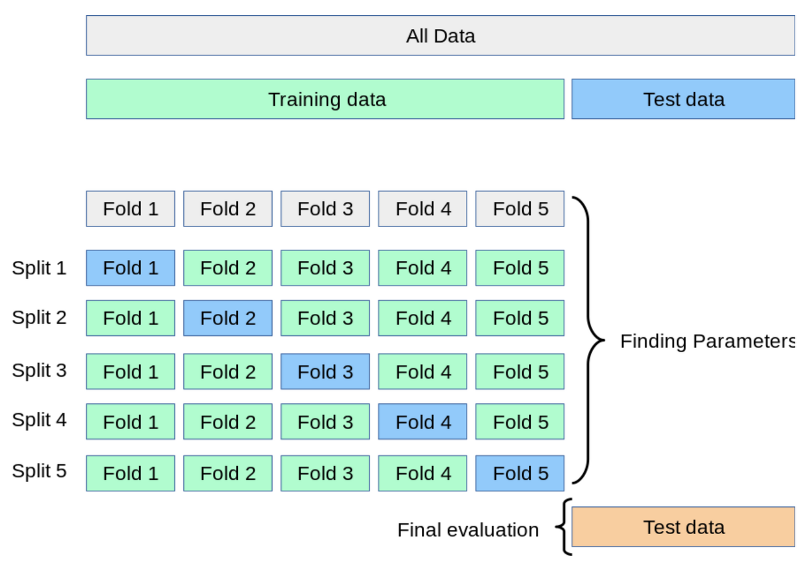

> ** 💡 Why test dataset Only If you verify Will it not work ?**
> All train datasets Learning and test dataset Verified The results I confirm it Let's do it . The developer should create a test dataset. Score Raise For , in the test dataset To be biased The model Tune in Will be It is . But important It is in the test dataset About Korea Accuracy Height thing Not only that , the model general Accuracy Height It is . Some The data is Even if you come in Constantly high Accuracy Showing The model good Because you're a model will do number Therefore , we have a validation dataset and a test dataset. Separately Verifying The process Through the model Need to generalize Do .

#### References

- [ Deep Learning Basics Optimization - Sally](https://bsm8734.github.io/posts/bc-d012-1-dlbasic-optimization/)
- [ What is Cross Validation (CV) ? - unhochoi](https://wooono.tistory.com/105)

---

## #23

#### XGBoost Do you know why ? this The model On Kaggle Will it be famous ?

**XGBoost(eXtreme Gradient Boosting)** is a tree Based on ensemble In learning most In the spotlight present Algorithm middle One . In the Kaggle competition. The top Occupied many Scientists use XGBoost While using extensively It was reported that GBM Based on But , GBM 's The downside is slow Execution time and Overfitting Absence of Regulation Etc. The problem Solve it In the spotlight there is .

XGBoost 's The advantages are Next It's the same .

- Classification and ** Outstanding in the regression area prediction Performance ** Demonstrate .
- XGBoost is Parallel processing Using , ** faster than GBM ** execution time It is visible .
- **Regularization, Early Stopping** features Through Overfitting To prevent number there is .
- Tree Pruning is provided . In advance Split and prune only up to the specified max_depth . And , upside down As you go up, there is a positive gain no Node Delete it .
- By itself Missing values I'll take care of it .
- At every iteration Cross validation Perform .

What is GBM(Gradient Boosting Algorithm)** Regression analysis or classification Analysis To perform number There is a ** prediction model ** ** Ensemble of prediction models Methodology ** in the ** boosting ** series under Algorithms . LightGBM, CatBoost, XGBoost are All GBM Based on was created . ( See details The content is [Gradient Boosting Algorithm Intuitive Understanding - DeepPlay]( https://3months.tistory.com/368 )

> ** 💡 boosting Technique It 's sequential in itself how Parallel processing Shall we do it ?**
> Three Possibility is raised . divided Every quarter Each Parallel processing or branching Divided spot Calculate Parallel processing Or , from the beginning, by feature Sort it Through Parallel processing will do number There is . ( More details The contents are [XGBoost 's Parallel processing how Is it possible ? - GoLab](http://machinelearningkorea.com/2019/07/25/xgboost-%EC%9D%98-%EB%B3%91%EB%A0%AC%EC% B2%98%EB%A6%AC%EA%B0%80-%EC%96%B4%EB%96%BB%EA%B2%8C-%EA%B0%80%EB%8A%A5%ED%95%A0%EA%B9%8C/) reference )

#### References

- [ Machine Learning Algorithm - XGBoost - RosyPark](https://rosypark.tistory.com/59)
- [Gradient Boosting Algorithm Intuitive Understand - DeepPlay](https://3months.tistory.com/368)

---

## #24

#### Ensemble In the method which Things Do you have it ?

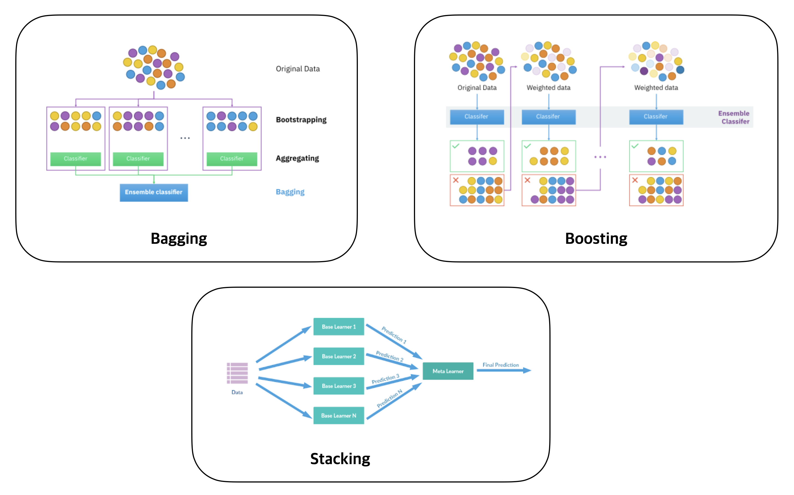

** Ensemble ** is Several The model Combined that The results Pull out smoking It is a method . " Accuracy high strong The model one Using More accurate than low weak The model Several mixture doing of the way Accuracy " high " is In concept Including It is a method . `Bagging`, `Boosting`, `Stacking`, etc. The method there is .

** Bagging (Bootstrap Aggregation) ** Sample Many times Pull (Bootstrap = Restore Random Sampling ) each The model Teach me The result Aggregating is a method . Category The data is vote By way of (Voting) The results Aggregate and continuous The data is On average Aggregate . Bagging Used Representative The technique involves the `Random Forest` method. There is . Learning The data is Not enough Even if not sufficient Learning effect subject Underfitting problem with high bias or high variance The overfitting problem caused by To solve Help Give .

** Boosting ** before Model's In the wrong answer Weight High Granted next The model Learning It is a method . The answer is wrong . Correct answer Match for In the wrong answer more Focus on Teach Because In general In bagging Compare Accuracy High . But Wrong In part about Repeatedly Because I'm learning Overfitting's The problem is , and in the outlier Vulnerable and slow Slow Cons too have There is a `GBM(Gradient Boosting)` method . Representative ones include `XGBoost, AdaBoost, GradientBoost` , etc. The algorithm It exists .

** Stacking ** several Individual The model As predicted The result value again Learning With a dataset By using The model fabricated It is a method . But Above Pictures and same fundamental Stacking The method is ` same The dataset Through As predicted The results Based on again Because we are learning , there is a problem of overfitting . There is . Therefore Cross Validation method for stacking Introducing this The problem To solve number There is data . Split it these middle Only some have Learned The model Several Make it The results are ` meta Learning As a dataset (meta train dataset) By using again Learning It is . This The method is many Individual Model's The results Combined prediction Performance Raise number There is The advantage is there is .

> ** 💡 Bagging vs Boosting **
> ** Bagging ** is Random Restoration extraction ( bootstrap ) Many times Repeatedly ** Parallel ** modeling Several Learning Ordered Next , the average smoking is a method . On the other hand , ** boosting ** is every The data In learning Use it , but if the answer is wrong more big Weight Two or three next The turn ** Sequential ** teaching It is a method .

#### References

- [ Machine Learning -11. Ensemble Learning : Bagging and Boosting - BaekKyunShin](https://bkshin.tistory.com/entry/%EB%A8%B8%EC%8B%A0%EB%9F%AC%EB%8B%9D-11-%EC%95%99%EC%83%81%EB%B8 %94-%ED%95%99%EC%8A%B5-Ensemble-Learning-%EB%B0%B0%EA%B9%85Bagging%EA%B3%BC-%EB%B6%80%EC%8A%A4%ED%8C%85Boosting)
- [1. Ensemble Technique and Bagging , boosting , stacking - data Delicious food ](https://data-matzip.tistory.com/entry/%EC%95%99%EC%83%81%EB%B8%94-%EA%B8%B0%EB%B2%95-%EC%A0%95%EB%A6%AC-1-%EC%95%99%EC%83%81%EB%B8%94Ensemble-%EA%B8%B0%EB%B2%95%EA%B3%BC-%EB%B0%B0%EA%B9%85Bagging-%EB%B6%80%EC%8A%A4%ED%8C%85Boosting-%EC%8A%A4%ED%85%8C%EC%9D%B4%ED%82%B9Stacking)

---

## #25

#### What is a feature vector? What could it be ?

** Feature ** refers to a sample ( data ) . well Explaining Measurable It is an attribute . It is a characteristic . Through specific Sample Quantify it To show number there is .
** Feature vector ** The features It's a set . If necessary As a vector Displaying The reason is Mathematically Dealing with Comfortable Because .
By data which Features have Is there Find it and Based on The data As a vector Converting The task is called ** feature extraction **. Do .
** characteristic What is space (feature space)** ? The observations present Space It means . This characteristic The space is several In dimension To be composed number There is . Some The data Feature space One As a vector Expressing In case , several characteristic The variable In the feature vector Influence line number There are . For example , features The variable One Data is one- dimensional characteristic In space Appear and features If there are N variables , then it is N- dimensional. characteristic In space To show number there is .

d- dimension Of the data characteristic The vector is Next together It is displayed .

$$
x = (x_1, x_2, ..., x_d)^T
$$

> ** 💡 In the field Followed Feature vector of meaning **
>
> - <strong> In computer vision ( images )</strong> Features include edges, corners , etc. means . pixels The value Rapidly Changing place , brightness change , color Change , gradient direction Etc. Matching Information, etc. By feature It is used for SIFT, SURF , etc. The method It exists .
> - ** In natural language processing ( text ) ** The features are word , morpheme , subword , token With the back To be expressed number , and BOW (Bag-of-Words) is In the document Of the word Occurrence Explaining Of the text vector It is an expression . If there are 8 In words Made Sentence to BoW When created , it is an 8- dimensional vector . One The word To express number there is .
In ** structured data ** The features are Each attribute ( column ) It means . Height , age , nationality Back By feature To be used number there is .

#### References

- [ Feature ( Machine Learning ) - Wikipedia ](<https://ko.wikipedia.org/wiki/%ED%94%BC%EC%B3%90_(%EA%B8%B0%EA%B3%84_%ED%95%99%EC%8A%B5)>)
- [4) What is machine learning ? - TCPschool.com](http://www.tcpschool.com/deep2018/deep2018_machine_learning)
- [ Machine Learning - Multidimensional Feature space and Dimensional Curse - Preliminary Developer ](http://blog.naver.com/PostView.nhn?blogId=qbxlvnf11&logNo=221323034856)
- [OpenCV - Feature Detection , Descriptor , Matching - JeongYongHwang](<https://wjddyd66.github.io/opencv/OpenCV(8)/>)
- [ Natural Language Processing Bag of Words](https://bsm8734.github.io/posts/bc-d016-2-nlp-bag-of-words/)
- [ Natural language Features and Preprocessing - GeumjaeLee](https://brunch.co.kr/@geumjaelee/4)

---

## #26

#### good Model's The definition is What could it be ?

one In a line In summary , good The model is ** data The pattern well Learned As a model ** , ** never Domicile no In the data about correct Judgement dismountable Model ** Lee good As a model will do number there is .

Machine learning , deep learning Back By using The model To create The reason is that ` the machine person instead Any Make a decision Get off It is for ` purpose . Therefore The model ` decides Instead of Machine , decision machine ` cheek number there is .
this From a point of view , good decision ( right decision ) dismountable The model good It is a model . Given Learning In the data Overfit Model's case , given With data just a little different The data is When you come in Properly Not classified Can't do it The situation It happens .
Therefore, ** of the model Generalization ** Made , new In the data About that too Appropriate Level of Performance Visible The model good As a model will do number there is .

For example , the prediction If it's a purpose , then it's real Correct answer and prediction Value of Difference (loss, cost, error ) Minimize doing The model most good It's a model . Also The probability Estimating In this case Likelihood Maximizing The model good As a model will do number there is .

#### References

- [ Machine learning Model evaluation and Model selection , algorithm Selection - Tensorflow Blog ](https://tensorflow.blog/%EB%A8%B8%EC%8B%A0-%EB%9F%AC%EB%8B%9D%EC%9D%98-%EB%AA%A8%EB%8D%B8-%ED%8F%89%EA%B0%80%EC%99%80-%EB%AA%A8%EB%8D%B8-%EC%84%A0%ED%83%9D-%EC%95%8C%EA%B3%A0%EB%A6%AC%EC%A6%98-%EC%84%A0%ED%83%9D-1/)
- [3. Machine learning Main Concept - Model - Aiden](https://isme2n.github.io/devlog/2017/10/27/machine-learning-3/)
- [ Model Learning Method and generalization Performance - Life 1](https://dragsoseumon.tistory.com/34 )

---

## #27

#### 50 of small Decision making The tree big Decision making Than a tree Is it okay ? Why like that Do you think ?

50 of small Decision making The tree The `Bagging` technique in ensembles Used As a model cheek number There is . Therefore , Bagging Representative The method is the `Random Forest` method. why Is it good? Explaining As such , why 50 small Decision making The tree more Is it better? I want to explain Do it .

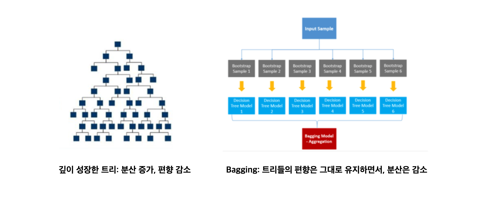

big The tree small Bias and big Variance Have Because , very depth adult The tree In training data about Overfitting It can be done using the Random Forest method. When you learn , the trees Bias is like that While maintaining , ** several Dataset / Multiple In case about Learn Because Dispersion ** to reduce number There is . Also one doggy Decision tree In this case , in the train data present In the noise about very Sensitive , but many The trees While making The average Inside , ** noise about Gangin ** sunset number There is . Therefore One deep / big Decision making 50 more than trees small Decision making The tree more good The model I'm going to finish it will do number there is .

> **Bagging(Bootstrap Aggregating)**

Bagging is bootstrapping ( repeating , extracting with replacement ) and aggregating it . It is a method . Originally In the dataset About Several small N datasets By sampling After making each The data small Model N dog Learning Order it . That next N learned The model every In one Combined Final As a model Using The methodology It means . After all , in parallel The data into several doggy The model at the same time To teach It is a method .

> **Random Forest**

Random Forest is several doctor decision The tree Created later Majority rule (hard voting) or On average (soft voting) according to Output Predicting It is an algorithm . That is doctor decision Wood and bagging Mixed It's called a form cheek number There is a Random Forest. The feature is bootstrap . By using Learning In the dataset various Sample Extract it Only some One time In learning To use It is . Data Sampling and Variable Make a choice Through doctor decision Of the tree Diversity To secure number There is . This Through Prediction of Volatility Reduced and overfitting To prevent number there is In missing values about It's strong Advantages have . but Of the data medical charge When it increases In the decision tree Compare The speed big Falling and the result About Korea Interpretation It's difficult The downside is there is .

#### References

- [Bagging, Boosting, Bootstrapping - Kwak Dong-hyeon , New Sight](https://newsight.tistory.com/247)
- [Bagging(Bootstrap aggregating ) Algorithm - InCastle](https://m.blog.naver.com/PostView.nhn?blogId=ysd2876&logNo=221219689884&proxyReferer=https:%2F%2Fwww.google.com%2F)
- [ Machine Learning : Random Forest Features , Concepts , Advantages , Disadvantages ](https://jjeongil.tistory.com/908)

---

## #28

#### Spam Logistic Regression in the filter many Using The reason is What could it be ?

Spam The filter is The mail Spam Is it mail? Whether or not About Korea The probability Calculate and ** classify ** the mail . It's a problem . Logistics Regression is Regression Based on The data is which In category Belong to The probability is between 0 and 1. By value Predict and that In probability according to Possibility more high In category under As a result It does classification map Learning It is an algorithm . In particular, ** the input value is ever so Big or Even if it's small, it's between 0 and 1 By value Mapping ** In that respect In classification problems It is suitable . Therefore Logistic The regression In the spam filter many is used .

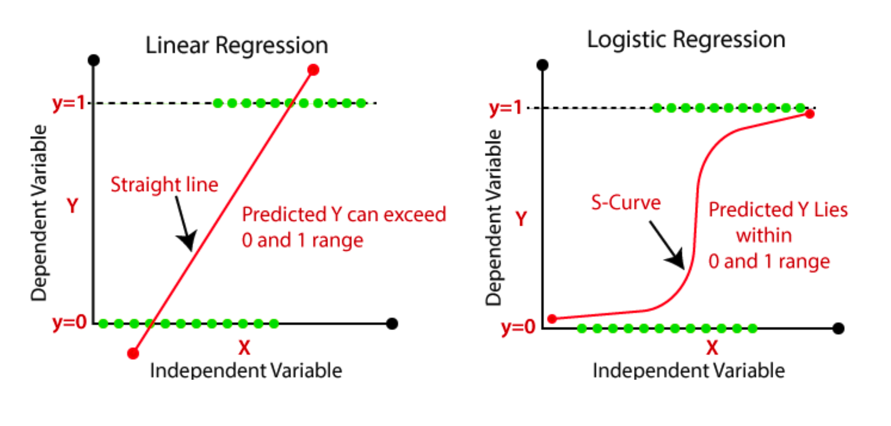

> ** In classification problems Logistic The regression appropriate reason **

Logistic Regression is ** sigmoid Function (sigmoid function) ** Through A linear function between 0 and 1 As a function Changed and S -shaped The shape It is visible .
Sigmoid Function of The definition is Below It's the same .

$$
S(x) = \frac{1}{1 + e^{-x}} = \frac{e^x}{e^x+1}
$$

Logistic Of regression The hypothesis function is Next It's the same .

$$
H(X) = \frac{1}{1 + e^{-(Wx+b)}} = sigmoid(Wx+b) = \sigma (Wx+b)
$$

x value No matter how much + or - Getting smaller Even if it grows Always between 0 and 1 The value Returns . The probability is between **0 and 1. range Inside ** These are necessary to come in The shape It is suitable .

In this way, H(x ) The value is between 0 and 1 When it comes out , regression is done with the hypothesis function above. one The result value is greater than or equal to the threshold (ex. 0.5) In this case 1 Classify and exceed the threshold If it's small, it 's 0 If you categorize it Become That's why .

> ** In classification problems Linear regression Not suitable Not reason **

` Figure 1` and together given The data Expressing The graph Draw , appropriate Branch As a standard two In a group To classify number there is .

At this time, the `new` data in ` Figure 2` New I came in Let's try it . The graph is new Data ` new` Influence Take it , down Tilted In the form of Updated , ` Figure 3` Red graph The shape It can be done .
like this If it is , it is originally 1 well Classified Of things The predicted value is Below the existing threshold It goes down to 0 Being classified The problem is It happens .

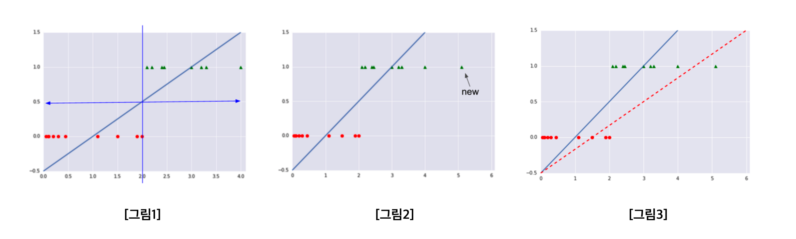

Linear regression The function is which The input value is Whether you come in or not So between **0 and 1 Range It also ** escapes .

Also , `H(x) = 100x` Hypothesis function There is Let's say x is greater than or equal to 0.01. In the case All 1 's are less than or equal to 0 In the case All to 0 To classify It becomes like this **x value too Sensitively Responding ** The model To be made number There is . Operationally very small Just the value Even if it changes At all The classification itself It changes .

more Furthermore , the linear model The probability is No , the dots By interpolation only Because it is done By probability To interpret number No. The predicted value is The probability is No because one Class and Other ** classes To distinguish number present meaning present The threshold is None .** Also Multi The class Eggplant As a classification problem To expand number There is none Problems too There are . These Problems Because , in classification problems Linear return The model is Not suitable Can't do it .

#### References

- [4.2 Logistic Regression - TooTouch](https://tootouch.github.io/IML/logistic_regression/)
- [5) Logistic Regression - Deep Learning Used Natural language treatment Introduction ](https://wikidocs.net/22881)
- [ Everyone For Deep Learning (sung kim)lec5-Logistic Classification - cdjs Coding Study Room ](https://cding.tistory.com/55)

---

## #29

#### OLS(ordinary least square) Regression The formula is What is it ?

** Ordinary Least Squares (OLS)** is a scatter plot Through Of the data distribution The graph When drawing , this Of the data The trend Know For The best Trend line Drawing For method middle It is one . OLS is Approximately Want to save The sun Actual Of the sun Error of Square of The sum Minimum price felled The year Seeking It is a method .

OLS Regression is Regression Through of the equation constant The values Estimating On the day is used . n number of Input values and To him Corresponding The output value $(x_i, y_i)(1\leq i\leq n) $ There is , and this Of the account The equation is Variables $x$ and $\beta=(\beta_0, \beta_1, \cdots , \beta_k ) $ For constant $\beta$ About Korea With the formula $f(x, \beta)$ be given When , $\sum_i(y_i - f(x_i, \beta))^{2} $ The value At least Making $\beta $ Seeking That is The problem is the goal .

I want to estimate doing With parameter β About Korea Expression Next together Save number there is .

$$
{\hat {\beta}}=(\mathbf { )}^{-1}{\big (} ~ {\textstyle \sum }\mathbf x_i y_i ~ {\big)}
$$

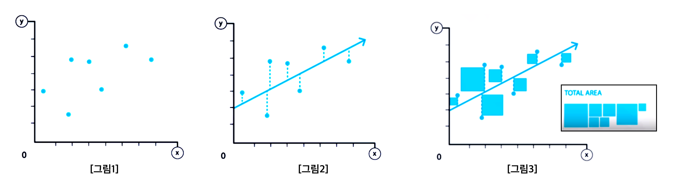

For example , 7 Of the data The trend representative The trend line is shown in ` Figure 2` together I drew it let's do it .
At this time Actual The y value ( actual value ) of the data and The y value ( predicted value ) of the trend line The car is called ** residual ** do . ( below On the graph The remainder is In a dotted line mark )
The least squares method This ** residual Square of The sum (RSS, Residual Sum of Squares ) At least doing ( weighting Vector ** is the method of obtaining .
Residual Square of The sum is in `TOTAL AREA` of ` Figure 3` Applicable Area and It's the same .

Residual Square of Sum Seeking Cold Below It's the same .

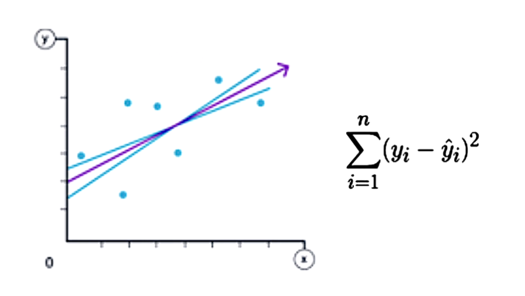

Blue Than the trend line purple Trend line The square of the residual The sum more It's small . So Blue Than the trend line purple The trend line The above 7 The data more well Expressing It's a trend line egg number there is .
like this Residual Square of Sum At least doing The method It is the least squares method , and the least squares method By utilizing The data most well Expressing Linear The regression line grill number there is .

> ** 💡 OLS vs. MSE**
>
> - OLS(Ordinary Least Square): Linear return The model making For Line and horizontal Minimum Square law , model When making Use .
> - MSE(Mean Square Error): Model Performance evaluation Indicators , models To evaluate at the time Use .

#### References

- [DATA-17. Least Squares Method (OLS ) Utilized Simple Linear Regression - Corner Study ](https://bkshin.tistory.com/entry/DATA-17-Regression)
- [ Linear regression - Wikipedia ](https://ko.wikipedia.org/wiki/%EC%84%A0%ED%98%95_%ED%9A%8C%EA%B7%80#Ordinary_least_squares)
- [ Least squares method - Wikipedia ](https://ko.wikipedia.org/wiki/%EC%B5%9C%EC%86%8C%EC%A0%9C%EA%B3%B1%EB%B2%95)
- [ Data Analysis 9. Regression Model - Outside the Home It's dangerous OTL](https://throwexception.tistory.com/943)

---
